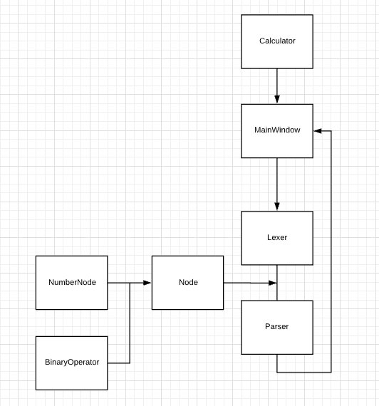

# Calculator

## Planering

C# WPF Framework

Problem: 
Skapa en Miniräknare. 
Så för att skapa en miniräknare behöver man på något sätt ha någon slags input som behövs bearbetning på något sätt. 

Sätt att lösa problemet: 
En sätt är att bara gå igenom en sträng och parse ut ett nummer ordning och sedan se vilken operator som är efter numret. Problem med denna methoden är att "operator precedence" är ett problem och kommer inte att fungera. Men det här sättet kräver inte lika mycket kod.

Ett annat sätt är att skapa en riktigt LL(1) parser för att den ska lösa problemet med "operator precedence" och det kommer att vara enklare att fixa andra saker som till exempel "SQRT" functionen. Men detta sättet kräver ganska mycket kod.

Klasser:

MainWindow - Starting Point

Lexer - Genererar <b>Tokens</b> från en sträng

Tokens 
Operators 
* \+
* \-
* \*
* /
* %

Parser LL(1) - Parsar tokens som kommer från lexern och försöker skapa nodes som sedan används för att generera ett mattematisk resultat. 

Node abstract 
Nodes:
* Number
* Sqrt
* BinaryOperation

Notes:
Main Methoden är auto generarad av Visual Studios WPF pipeline.

